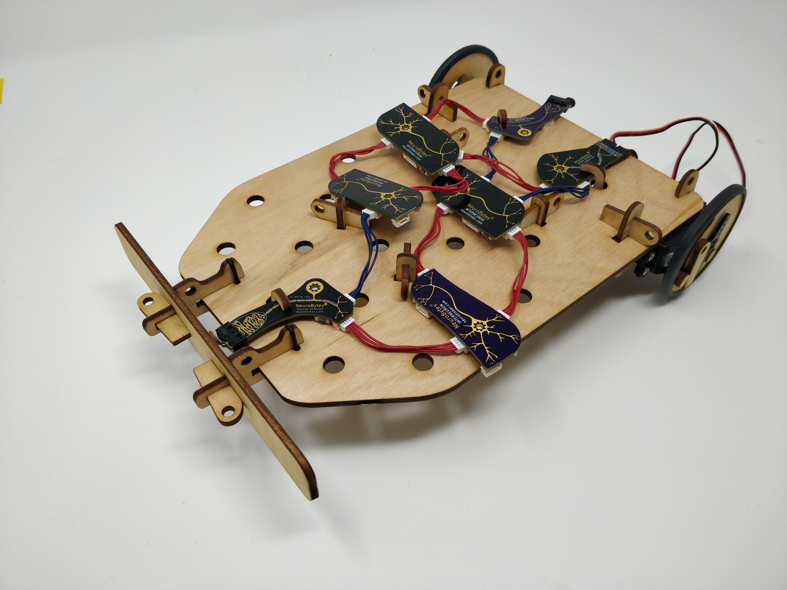

# NeuroBuggy

Laser cutting files and original design documents for NeuroBuggy, our take on the Braitenberg Vehicle. Our NeuroBuggy kit will be for sale soon at https://www.neurotinker.com; until then, you should use these files and make your own. We also encourage reusing parts of our design (such as the caster mount or wedge securements); if you do this, please be sure to respect the terms of our license.

The NeuroBuggy was designed in Inkscape and is released under the terms of the Creative Commons Attribution-ShareAlike 4.0 license, available here: http://creativecommons.org/licenses/by-sa/4.0/.
<a rel="license" href="http://creativecommons.org/licenses/by-sa/4.0/"></a>
## Files
```NeuroBuggy_master.svg``` is an Inkscape *.svg file that contains all of the original NeuroBuggy designs, including previous drafts. You'll see a lot in the 'layers' window, including a number of NeuroBytes boards used for sizing various bits and pieces.

```cut_file.dxf``` and ```cut_file.eps``` are two exports from the NeuroBuggy_master.svg 'parts' layer. One of them should work for your laser cutter, or just do it directly from Inkscape if you are fancy.

```instructions.pdf``` is a section from our NeuroBytes NeuroBuggy Kit manual that covers buggy construction and a few example circuits. Yes the *.pdf is large. It's because the pictures are pretty. 
## Assembly Notes
The NeuroBuggy is designed to be cut from 3mm or 1/8" plywood. The fasteners, most of which take the form of small wedges, work with a range of material thicknesses so the exact stock isn't too important. Our production kits use basswood, while some of our prototypes were made with mahogany or birch plywood. You may be able to get away with acrylic, but if you want to use plastic (gross) you probably should use something stronger like Delrin.

In addition to the wood parts, if you want to build a buggy you will need a few other bits:
* two continuous rotation hobby servos, such as SM-S4303Rs, including horns and horn mounting screws.
* a 1" plastic ball. Most materials (Delrin, polyurethane, etc) seem to work well enough.
* two O-rings for the bumper, 3/4" OD x 1/16" thickness.
* a bit of wood glue (such as Titebond III) to secure knobs to the wheels.
* two wide rubber bands, such as the type used to make lobster claws safe.

Once you have cut all the parts out, follow the instructions in the *.pdf file for assembly and (if you have a bunch of NeuroBytes boards) circuit construction.
